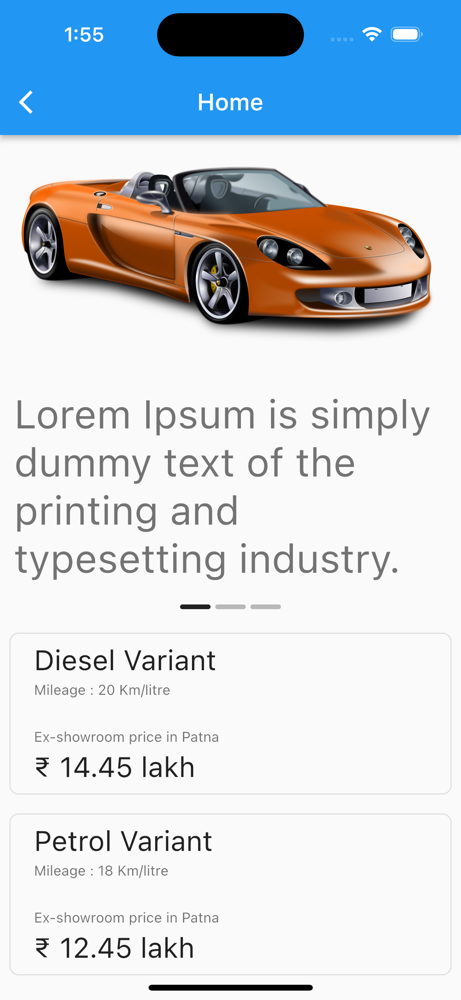

# Flutter Login Flow design with animation

This project has login flow design and simple animation widgets are used here to add interactivity in the app.

    
    

## Branches

Project without animation
> git checkout start

Project with animation
> git checkout anim

# License

This application is released under the [MIT license](LICENSE). You can use the code for any purpose, including commercial projects.

